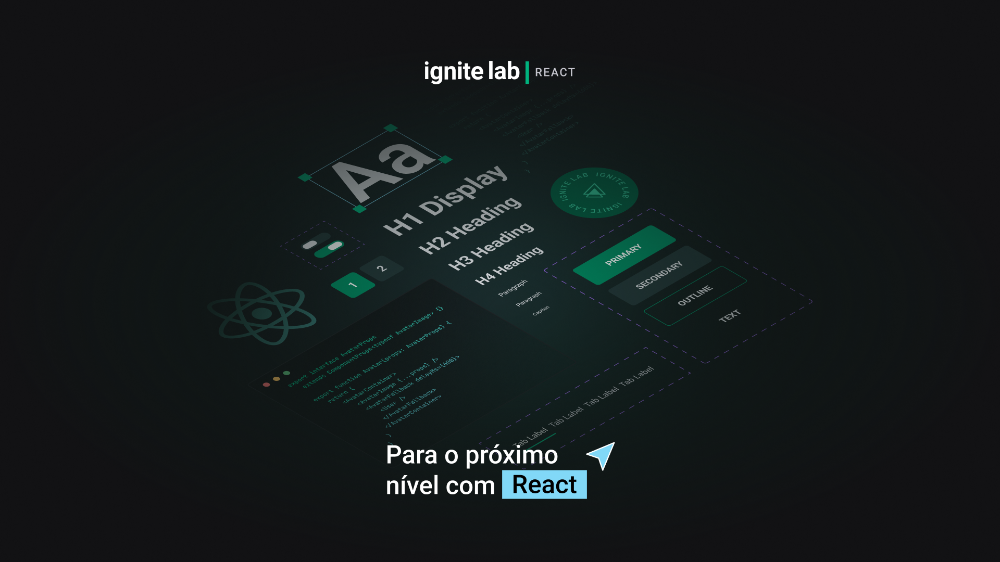
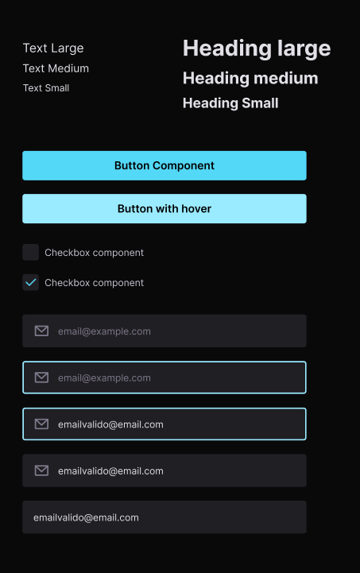
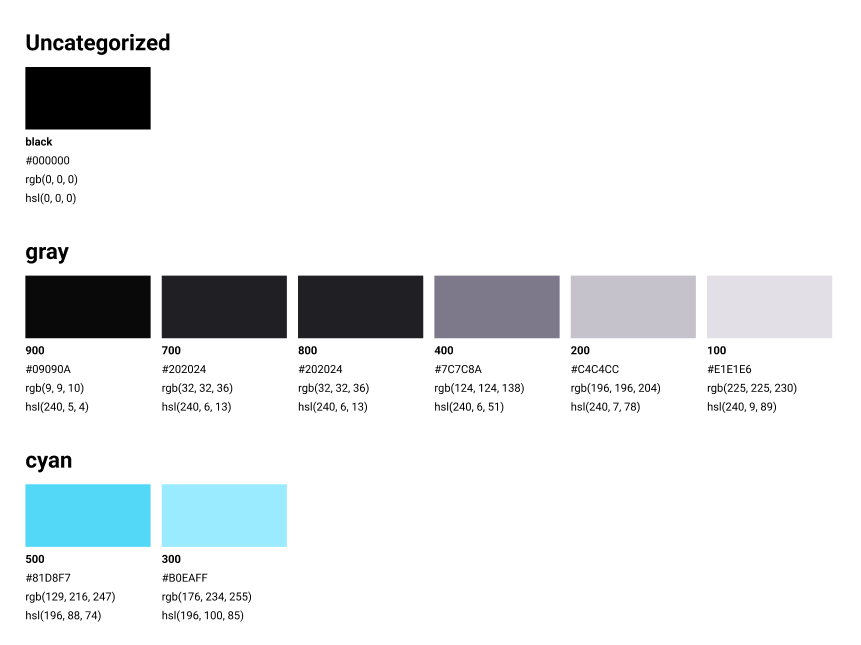

<h1 align="center">
   Design System
</h1>

  

 

  

## 💻 Projeto

O objetivo desse projeto foi criar um Design System no Figma e implementá-lo em React com documentação e testes automatizados dentro do Storybook.
Esse projeto foi desenvolvido durante o evento Ignite Lab da RocketSeat.

## 🚀 Tecnologias
Esse projeto foi desenvolvido com as seguintes tecnologias:

- Figma
- React e Typescript
- Tailwind e PostCss
- StoryBook
- Jest
- Vite

## 💻 Configuração

Para rodar o projeto é necessário possuir uma versão do node superior a 16.

    Rodar o projeto:
    <pre><code>npm run dev
    </code></pre>
    Rodar o storybook:
    <pre><code>npm run storybook
    </code></pre>

## 🔖 Layout

Você pode visualizar o layout do projeto através [desse link](https://www.figma.com/file/dv5861SOxVj0MCMHOmXhUr/Ignite-Lab-Design-System?node-id=0%3A1). É necessário ter conta no [Figma](https://figma.com) para acessá-lo.

